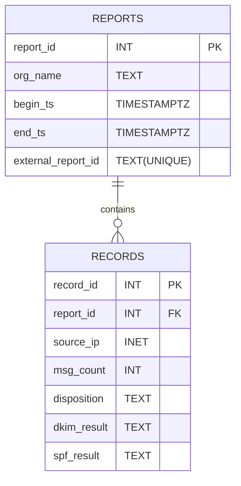

## Table of Contents
- [Database Setup](#database-setup)
- [Automation: Python and SQLAlchemy](#automation-python-and-sqlalchemy)

I recently decided to explore both data analysis and email security by designing an analysis pipeline for DMARC XML aggregate reports. The general idea is to take a directory containing all the XML files, parse that directory into dictionaries, then insert each report and their corresponding records into a database. This can then be queried for data analysis and research.

This post will go over the design process (at least up until now), as well as some preliminary results. Then I will write a second post later on which will contain a full analysis of my findings, and some conclusions based on them. There may be a third post on future modifications to the tool, but I haven't decided on that yet.

[Here](https://github.com/loleik/dmarc-analysis) is the GitHub repo for this project.

### Database Setup

First I had to decide on the DBMS to use for the project. On one hand, SQLite would be more lightweight as it is an embedded DBMS that doesn't require a separate server process, whereas PostgreSQL is designed for large datasets with high-traffic applications. I ended up going with PostgreSQL as having experience with it would look good, but in hindsight going with SQLite may of been better for this project.

Anyway, first I decided to try and create the database and tables directly within PostgreSQL. I'm running Arch Linux, so following the Arch Wiki made setting it up quite simple. After switching to the `postgres` user, and accessing the `psql` cli, I could then design the database schema.

Here's a entity relationship diagram for the schema I intend to implement:



As you can see, we have a `reports` table, which will contain information within each individual XML file. The primary key is the `report_id`, which we will let PostgreSQL sort out, and it will be unique by design. The rest of the fields are extracted from the XML files. They correspond to the organisation name, the timestamps of the beggining and end of the reporting period, and the report ID assigned by the sender of the report which is also unique. Then we have a `records` table, which will contain the various reports that are contained within each report. The public key of this table is `record_id`, which will be defined in a similar way to `report_id`. The `report_id` acts as a foreign key, creating a relationship between the tables. The rest of the fields are again extracted from records within reports.

The relationship between these tables is __One (Mandatory) to Zero or More (Optional)__. This means that each report, which must exist, can contain zero or more records, which may not exists.

Here are the SQL statements for creating the tables, with an `INSERT` statement for each just to test them (with values removed):

+ `reports`:
    ```
    CREATE TABLE reports (
        report_id           SERIAL PRIMARY KEY,
        org_name            TEXT,
        begin_ts            TIMESTAMPTZ,
        end_ts              TIMESTAMPTZ,
        external_report_id  TEXT,
        UNIQUE (external_report_id)
    );

    INSERT INTO reports (
        org_name,
        begin_ts,
        end_ts,
        external_report_id
    )
    VALUES (
        'example.org',
        to_timestamp(begin_ts),
        to_timestamp(end_ts),
        'external_id'
    );
    ```
    As you can see, we don't need to define the `report_id` as it's defined as a `SERIAL PRIMARY KEY`, this is handled automatically.
+ `records`:
    ```
    CREATE TABLE records (
        record_id   SERIAL PRIMARY KEY,
        report_id   INTEGER NOT NULL REFERENCES reports(report_id),
        source_ip   INET,
        msg_count   INTEGER,
        disposition TEXT,
        dkim_result TEXT,
        spf_result  TEXT,
        CONSTRAINT unique_dmarc_record
            UNIQUE (report_id, source_ip, disposition, dkim_result, spf_result)
    );

    INSERT INTO records (
        report_id,
        source_ip,
        msg_count,
        disposition,
        dkim_result,
        spf_result,
    )
    VALUES (
        report_id,
        'source_ip',
        x,
        'none',
        'pass/fail',
        'pass/fail'
    );
    ```
    Again, we don't need to explicitely define `record_id` as it's defined as a `SERIAL PRIMARY KEY`. We do need to specify the `report_id` of the report the record is in though, which we can get by querying the database using the `external_report_id`.

That's the setup for the database that I used for the rest of this project. So now lets move on to the automation, as inserting all these reports manually wouldn't exactly be reasonable.

### Automation: Python and SQLAlchemy


-- Lolei <3